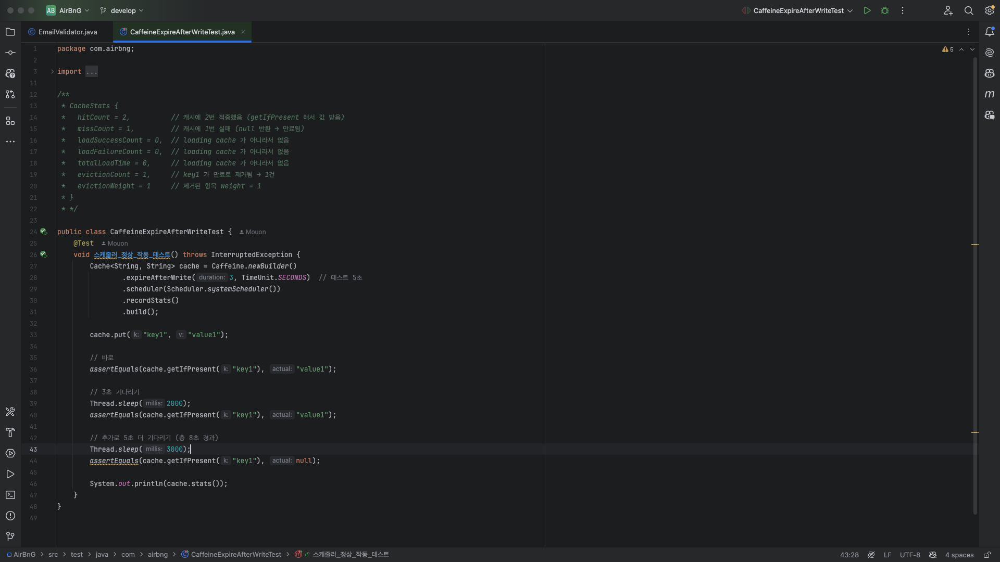
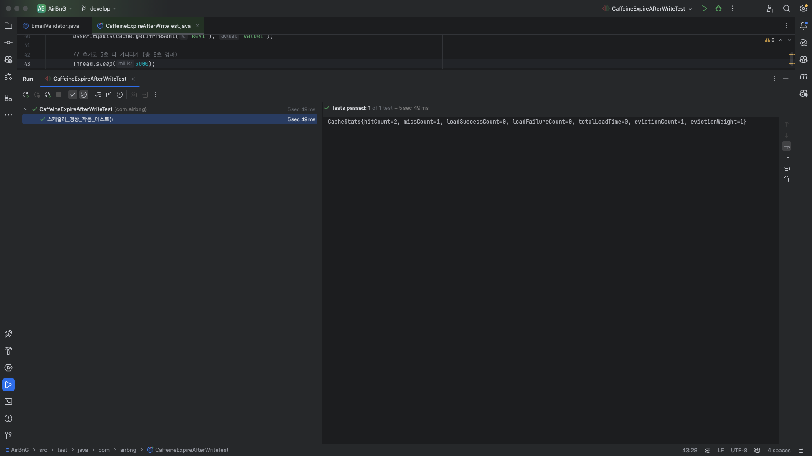

# Caffeine Cache 로 동시성 제어하기!

바로 이전 글에서 다룬 동시성 제어와 관련하여, 코드 차원에서 처리할 수 있는 방법을 찾던 중 이번에 적용한 방안을 정리하게 되었다.

현재 진행중인 프로젝트는 단일서버이기 때문에 레디스는 오버 스펙이라고 판단해 JVM 수준의 락을 고려하던 중, 기존에 알고 있던 ReentrantLock을 활용하기로 결정했다.

처음에는 ConcurrentHashMap을 통해 락을 관리하려 했지만, 여러 문제점이 있었고, 실제 실무에서는 이러한 방식 대신 Caffeine Cache를 활용하는 추세라는 점을 알게 되었다. 이에 이번 프로젝트에서는 Caffeine Cache를 도입하여 락을 효율적으로 관리해보기로 하였다.

## 1. Caffeine Cache란?

Caffeine Cache는 Java 기반의 고성능 메모리 캐시 라이브러리로, Guava Cache의 단점을 개선한 후속작(?)으로 개발되었다

JVM 환경에서 동작하며, Guava Cache 대비 약 10~50배 높은 성능을 제공한다고한다.

#### 주요 특징

- JVM 메모리 캐시 중 최고 수준(?)의 성능
- 최신 JVM 최적화 적용

### 2. 필요성 (기존 한계점)

| 방법              | 한계점                                                                 |
|-------------------|------------------------------------------------------------------------|
| ConcurrentHashMap | TTL(유효시간) 및 Eviction(삭제) 기능 미지원, Memory Leak 위험 존재     |
| Guava Cache       | Eviction(삭제) 관련 성능 부족                                           |

### 3. Caffeine Cache 장점
- TTL 기능 지원 (expireAfterAccess, expireAfterWrite) ← 9번 주의사항 참고!!!
- eviction 기능 지원 (용량 기반, 시간 기반)
- W-TinyLFU 알고리즘 적용 (높은 hit rate 제공)
- Thread-safe
- 별도 인프라 불필요 (JVM 내에서 동작)
- GC 친화적 (GC 부하 최소화)
- Spring Boot 3.x 및 JDK 17과 완벽 호환

### 4. Reservation 동시성 처리 적용 배경
#### 기존 문제점
- reservationId 단위로 승인 및 취소 요청이 동시에 발생
- ConcurrentHashMap 사용 시 lock 객체가 계속 메모리에 남아 Memory Leak 가능성 존재
#### Caffeine Cache 적용 효과
- expireAfterAccess을 통해 일정 시간 동안 미사용 시 자동 제거
- 높은 성능 유지
- 코드 복잡도 감소
- 유지보수성 향상
- 메모리 안전성 개선 ← Memory Leak 해결

### 5. 프로젝트 적용 가이드
#### 5.1 의존성 추가 (Maven)

```maven

<dependency>
    <groupId>com.github.ben-manes.caffeine</groupId>
    <artifactId>caffeine</artifactId>
    <version>3.1.8</version>
</dependency>

```

#### 5.2 의존성 추가 (Maven)
```java

@Configuration
public class CacheConfig {

    @Bean
    public Cache<Long, ReentrantLock> reservationLocks() {
        return Caffeine.newBuilder()
                .expireAfterAccess(10, TimeUnit.MINUTES)
                .build();
    }
}

```
#### 5.3 사용 예시 (Service)
```java

@RequiredArgsConstructor
@Service
public class ReservationServiceImpl implements ReservationService {

    private final Cache<Long, ReentrantLock> reservationLocks;

    @Transactional(isolation = Isolation.REPEATABLE_READ)
    public ReservationCancelResponse updateReservationState(Long reservationId) {
        ReentrantLock lock = reservationLocks.get(reservationId, key -> new ReentrantLock());
        try {
            lock.lock();
            // 비즈니스 로직
        } finally {
            lock.unlock();
        }
    }
}

```

## 6. Caffeine 내부 구조

### 6.1 전체 개요
- 내부적으로 ConcurrentHashMap 기반으로 데이터 저장
- 접근 흐름:
   - Read Buffer → Write Buffer → ConcurrentHashMap + eviction queue → Cleanup task

### 6.2 주요 구성 요소

#### 구성 요소역할
| 구성 요소                         | 설명                                                                 |
|----------------------------------|----------------------------------------------------------------------|
| Read/Write Buffer                | 비동기 적재(Async Loading)를 위한 버퍼                               |
| ConcurrentHashMap                | 실제 캐시 데이터 저장소                                              |
| Window / Probation / Protected 영역 | W-TinyLFU eviction 알고리즘 기반 데이터 관리 영역                     |
| Window Queue                     | 최신 접근 데이터 관리 (LRU)                                          |
| Probation Queue                  | 새 항목 관리 영역                                                   |
| Protected Queue                  | 고빈도 접근 항목 보호 영역                                          |
| TimerWheel                       | `expireAfterAccess` / `expireAfterWrite` 시간 관리                   |
| CountMinSketch                   | 데이터 접근 빈도 추적 후 eviction 기준 계산                          |

### 6.3 eviction 흐름

- 신규 데이터 → Probation 영역 등록
- 일정 이상 빈도로 접근 시 Protected 영역으로 승격
- 오래되거나 접근 빈도가 낮은 항목은 eviction 처리
- TTL 정책은 TimerWheel에 의해 자동 관리됨

### 6.4 성능 우수한 이유

- W-TinyLFU 알고리즘 기반 eviction
- 버퍼 기반 비동기 처리
- 기존 LRU보다 효율적인 메모리 사용
- GC 친화적 (소규모 객체 관리)
- lock 경합 최소화 (Hash multi-sketch 기반)

## 7. Guava Cache 대비

### 항목Guava CacheCaffeine Cache

| 항목                  | LRU             | W-TinyLFU       |
|-----------------------|------------------|------------------|
| Eviction 알고리즘     | LRU              | W-TinyLFU        |
| 성능                  | 중간             | 최고 수준        |
| 비동기 로드 지원       | 약함             | 강함             |
| TTL / Eviction 정책   | 제한적           | 정교함           |
| GC 부하               | 상대적으로 높음  | 낮음             |
| 최신 JVM 최적화 반영  | 부족             | 적극 반영        |

## 8. 결론

Caffeine Cache는 현재 가장 우수한 JVM in-process cache로서,

- Reservation 동시성 처리에 최적화된 선택지이며
- Memory Leak 방지 및 성능 최적화에 효과적이다
- 유지보수성과 안정성을 모두 확보할 수 있다

(근데 실무는 거의 MSA 라.. 2차 프로젝트에서 사용하는 분산락과.. DB 수준에서의 트랜잭션 격리가 주요해보인다!)


## 9. 주의점
- Caffein Cache는 기본적으로 **time-based eviction(시간 기반 만료)** 을 자동으로 수행하지 않는다→ 별도 스케줄러 설정 없으면, cache에 아무 작업이 없을 경우 expired entry가 남아있을 수 있음
- → write 이벤트나 read 이벤트 후에만 작은 maintenance 작업이 수행됨
- Scheduler 설정→ 일정 주기로 만료된 entry를 정리할 수 있음
- → 단, system load 등에 영향을 받기 때문에 정확한 eviction 시점을 보장하진 않음 (best-effort : 최선을 다하지만.. 뭔느낌인지 알겠져?)
- → Scheduler.systemScheduler() 등을 사용하면
- 이슈 댓글에서도 timely expiration이 필요하면 Scheduler를 명시적으로 쓰라고 권장

### 실제 테스트
캐시의 만료 정책(expireAfterWrite)이 정확히 동작하는지 확인하기 위해, 간단한 테스트 코드를 작성하여 실험을 진행하였다.  



```java

Cache<String, String> cache = Caffeine.newBuilder()
                .expireAfterWrite(5, TimeUnit.SECONDS)  // 테스트 5초
                .scheduler(Scheduler.systemScheduler())
                .build();

```

- TTL(Time To Live)은 5초로 설정했다.
- 공식 문서의 권장에 따라 Scheduler.systemScheduler()를 명시적으로 지정해, 만료 처리를 위한 스케줄링이 내부적으로 활성화되도록 했다.

#### 테스트는 캐시에 값을 넣은 후, 다음 세 가지 시점에서 동일한 키에 접근하며 진행했다:
1. 즉시 접근 (0초 경과)
2. 3초 후 접근 
3. 8초 후 접근

```java
// 바로
        assertEquals(cache.getIfPresent("key1"), "value1");

        // 3초 기다리기
        Thread.sleep(3000);
        assertEquals(cache.getIfPresent("key1"), "value1");

        // 추가로 5초 더 기다리기 (총 8초 경과)
        Thread.sleep(5000);
        assertEquals(cache.getIfPresent("key1"), null);
```

스케줄러가 정상 작동한다면 만료시간이 5초보다 적은 바로접근과 3초후 접근에서는 캐시가 적중하고
그 이후 8초후 접근에서는 캐시 미스가 발생하여야 한다.

다음은 실제 테스트 결과이다.



예상대로 캐시는 5초가 지나기 전까지는 값을 유지하고,
5초 경과 이후에는 자동으로 만료되어 null이 반환되었다.

이는 Scheduler를 명시적으로 지정함으로써 TTL 정책이 정확히 적용된다는 것을 보여준다.
즉, expireAfterWrite와 함께 스케줄러 설정은 TTL 기반 캐시 만료가 실시간으로 적용되기 위한 핵심 요소임을 확인할 수 있었다.  

#### 레퍼런스
https://medium.com/naverfinancial/%EB%8B%88%EB%93%A4%EC%9D%B4-caffeine-%EB%A7%9B%EC%9D%84-%EC%95%8C%EC%95%84-f02f868a6192

https://blog.yevgnenll.me/posts/spring-boot-with-caffeine-cache

https://github.com/ben-manes/caffeine/wiki/Benchmarks
