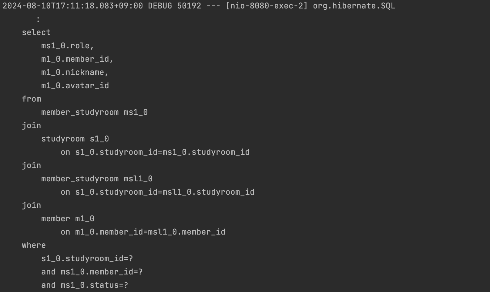
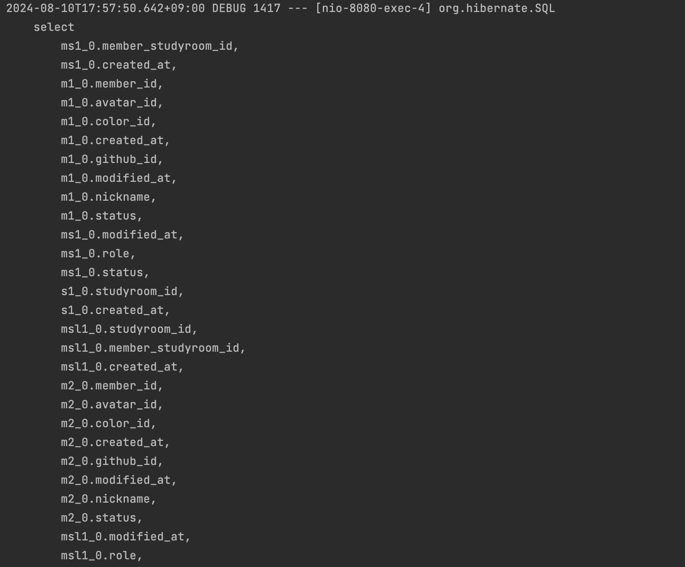
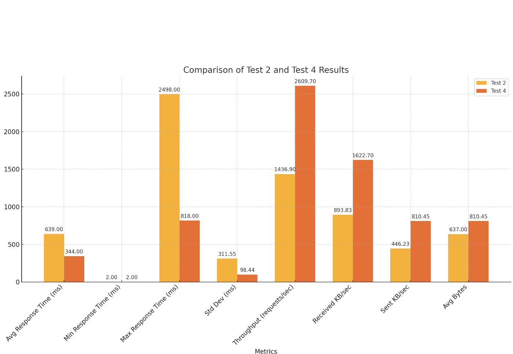

# SELECT 절 최적화를 통한 API 성능개선 해보기

JPA를 공부하던 중 전 우아한형제들의 이동욱님의 영상을 보게되었다. [수십억건에서 QUERYDSL 사용하기](https://m.youtube.com/watch?si=Jxf1-cfuPN_mFssc&v=zMAX7g6rO_Y&feature=youtu.be)라는 영상이었다.  
해당영상은 QUERYDSL을 사용하시며 정말 많은 DB속에서 최적화를 하기위해 고민하신 이야기를 들을 수 있는 정말 유익한 영상이었다.  
이런 좋은 영상을 보면 나의 프로젝트에 도입할 수 있는 부분은 무엇인가 찾아보게되는 습관이있다.  
지금 진행중인 프로젝트에선 QUERYDSL을 사용하지않아 QUERYDSL과 직접적인 관련있는 부분은 도입하진 못했다. (추후에 꼭 도입할것이다!)  
하지만 영상내용중 JPA를 사용할때 엔티티자체를 조회하는것보다 DTO를 조회할 수 있고 그럴때 성능면에서 이득을 보셨다는 이야기를 접할 수 있었다!  

마침 내가 만들어둔 API에 오류가 발견되어 수정이필요했는데 이부분을 적용해보기로 했다.  
우선 아쉽게도 DTO를 매핑하려면 현재 API스팩에선 두개의 DB접근이 불가피하다  
그래서 포기한건 아니고..  
사실 DTO를 조회하라고 하신말씀의 핵심은 필요한값만 SELECT하는것이 좋다라는 의미로 해석될 수 있다고 판단했다.  
그래서 나는 쿼리문을 수정해보았다!  

우선 응답 DTO의 구조를 먼저 파악해보자!  
```java

@Getter
@AllArgsConstructor
@NoArgsConstructor
public class DetailStudyroomResponse {

    private Long studyroomId;
    private MemberRole role;
    private List<Member> members;

    @Getter @Setter
    @AllArgsConstructor
    public static class Member{
        Long memberId;
        String nickname;
        Long avatarId;
    }

}


```

DTO를 보면 필요한값은 스터디룸 아이디, 조회한 맴버의 역할, 그리고 스터디룸에 속한 맴버들의 아이디,닉네임,아바타아이디인 것을 알 수 있다!

이제 API 요청을 보자!
```
http://localhost:8080/studyroom/detail?studyroomId=2
```
API요청을 보면 스터디룸 아이디를 쿼리파람으로 요청 중이다.  

여기까지 보면 studyroomId는 이미 쿼리파람에 있으므로 DB에서 조회할때 조회할 필요가 없음을 알 수있다. (영상에도 나름 핵심으로 나왔던 부분이다. 동욱님께서도 파라매터에 포함된 값을 검토하시고, SELECT항목에서 제외하셨다.)

이제 JPQL로 쿼리를 작성해보겠다!

```java

    @Query("SELECT ms.role, m.memberId, m.nickname, m.avatar.id " +
            "FROM MemberStudyroom ms " +
            "JOIN ms.studyroom s " +
            "JOIN s.memberStudyroomList msl " +
            "JOIN msl.member m " +
            "WHERE ms.studyroom.studyroomId = :studyroomId " +
            "AND ms.member.memberId = :memberId " +
            "AND ms.status = :status")
    List<Object[]> getStudyroomDetail(long studyroomId,long memberId, BaseStatus status);

```

조금은 복잡하지만 살펴보면 관계테이블을 조인하여 `ms.role, m.memberId, m.nickname, m.avatar.id` 이 값들만 조회하고있음을 확인 할 수 있다!  

API에 요청을 보내보면 아래와 같은 로그를 확인할 수 있다.  


쿼리가 짧은 것을 볼 수 있다.  

그렇다면 그냥 엔티티를 조회하면 어떻게 될까?  

우선 엔티티자체를 조회하는 쿼리를 보겠다.  
```java

    @Query("SELECT ms FROM MemberStudyroom ms " +
            "JOIN FETCH ms.member JOIN FETCH ms.studyroom s " +
            "JOIN FETCH s.memberStudyroomList msl " +
            "JOIN FETCH msl.member " +
            "WHERE ms.studyroom.studyroomId = :studyroomId " +
            "AND ms.member.memberId = :memberId " +
            "AND ms.status = :status")
    Optional<MemberStudyroom> getStudyroomDetail(long studyroomId,long memberId, BaseStatus status);


```  
###### 나름 JOIN FETCH도 사용하며 N+1 문제 등을 해결하려고 노력했던 작성 당시의 최선의 쿼리였다...

해당 쿼리를 살펴보면 `SELECT ms`로 MemberStudyroom 자체를 조회하고있다. JOIN FETCH으로 연관 테이블까지 한번에!  

이 쿼리를 기반으로한 API를 실행하면 아래같은 로그를 확인할 수 있다.  
  
###### 로그가 담기지도 않는다..
```
    select
        ms1_0.member_studyroom_id,
        ms1_0.created_at,
        m1_0.member_id,
        m1_0.avatar_id,
        m1_0.color_id,
        m1_0.created_at,
        m1_0.github_id,
        m1_0.modified_at,
        m1_0.nickname,
        m1_0.status,
        ms1_0.modified_at,
        ms1_0.role,
        ms1_0.status,
        s1_0.studyroom_id,
        s1_0.created_at,
        msl1_0.studyroom_id,
        msl1_0.member_studyroom_id,
        msl1_0.created_at,
        m2_0.member_id,
        m2_0.avatar_id,
        m2_0.color_id,
        m2_0.created_at,
        m2_0.github_id,
        m2_0.modified_at,
        m2_0.nickname,
        m2_0.status,
        msl1_0.modified_at,
        msl1_0.role,
        msl1_0.status,
        s1_0.modified_at,
        s1_0.status,
        s1_0.studyroom_name,
        s1_0.studyroom_profile 
    from
        member_studyroom ms1_0 
    join
        member m1_0 
            on m1_0.member_id=ms1_0.member_id 
    join
        studyroom s1_0 
            on s1_0.studyroom_id=ms1_0.studyroom_id 
    join
        member_studyroom msl1_0 
            on s1_0.studyroom_id=msl1_0.studyroom_id 
    join
        member m2_0 
            on m2_0.member_id=msl1_0.member_id 
    where
        s1_0.studyroom_id=? 
        and m1_0.member_id=? 
        and ms1_0.status=?

```
이게 로그 전문이다.  
아주 길다.. 연관테이블 정보까지 모두 포함한 조회쿼리결과다.  
실제로 비즈니스 로직에서 사용하지 않는 결과까지 다수 포함되어있다.  
이렇게 SELECT하는 것이 많으면 응답시간이 느려질 수 밖에없다.  

이제 성능테스를 해보겠다.  
성능테스트에는 JMete를 사용했다.  
100,000건의 요청테스를 진행하였다.  
결과는 다음과같다.  


| 지표                   | 쿼리 개선 전             | 쿼리 개선 후             | 개선율 (%)       |
|------------------------|---------------------|---------------------|------------------|
| 평균 응답 시간 (ms)     | 639ms               | 344ms               | 46.2% 개선       |
| 최소 응답 시간 (ms)     | 2ms                 | 2ms                 | 0% (동일)        |
| 최대 응답 시간 (ms)     | 2498ms              | 818ms               | 67.3% 개선       |
| 표준 편차 (ms)          | 311.55ms            | 98.44ms             | 68.4% 개선       |
| 처리량 (requests/sec)   | 1436.9 requests/sec | 2609.7 requests/sec | 81.5% 개선       |
| 오류율 (%)              | 0%                  | 0%                  | 0% (동일)        |
| Received KB/sec         | 893.83KB/sec        | 1622.7KB/sec        | 81.5% 증가       |
| Sent KB/sec             | 446.23KB/sec        | 810.45KB/sec        | 81.6% 증가       |
| 평균 응답 크기 (Bytes)  | 637.0Bytes          | 810.45Bytes         | 27.2% 증가       |

50프로 이상의 전체적인 성능 개선을 확인할 수 있었다.  
  
특히 이전과 비교했을때, 쿼리 최적화를 통해 응답 시간이 크게 줄어들고, 처리량이 증가한 점을 확인할 수 있다.  
필요하지 않은 데이터를 제거함으로써, 네트워크 트래픽과 데이터베이스 부하가 줄어든 결과라고 추측된다.  

추가적으로 다른 API에는 DTO를 직접 조회하도록 JPQL을 활용해 쿼리를 작성했다.  
DTO를 통해 조회하도록하면 서비스 계층에서 엔티티를 DTO로 매핑하는 로직이 생략되어 로직도 단순해지고, 쿼리도 최적화되는  
많은 이점을 가져갈 수 있다.  

아래는 DTO를 조회하는 예시이다.  
```java
    @Query("SELECT new com.linkode.api_server.dto.studyroom.DataListResponse$Data(d.dataId, d.dataName, d.dataUrl) " +
            "FROM Data d WHERE d.studyroom.studyroomId = :studyroomId AND d.dataType = :type AND d.status = :status")
    Optional<List<DataListResponse.Data>> getDataListByType(Long studyroomId, DataType type , BaseStatus status);
```  
`new com.linkode.api_server.dto.studyroom.DataListResponse$Data(d.dataId, d.dataName, d.dataUrl)`이 부분이 DTO를 조회하는 부분이다.  

이렇게 작성하면 당연히 SELECT절에서 필요한 값만을 조회할 수 있게되고  
서비스 로직에 아래처럼 단순하게 작석할 수 있게 된다.  
```java
    public DataListResponse getDataList(long memberId , long studyroomId, DataType type){
        if(!memberstudyroomRepository.existsByMember_MemberIdAndStudyroom_StudyroomIdAndStatus(memberId,studyroomId,BaseStatus.ACTIVE)){
            throw new MemberStudyroomException(NOT_FOUND_MEMBER_STUDYROOM);
        }
        List<DataListResponse.Data> dataList= dataRepository.getDataListByType(studyroomId,type, BaseStatus.ACTIVE)
                .orElseThrow(()->new DataException(NOT_FOUND_DATA));
        return new DataListResponse(dataList);
    }
```  

이번 경험을 통해 좀 더 효율적인 쿼리를 작성할수 있을 것같다.  
이번 경험을 통해 좀 더 효율적인 쿼리를 작성할 수 있을 것 같다. 
앞으로 새로운 API를 개발하거나 기존 API를 리팩토링할 때, 
SELECT 절 최적화를 항상 염두에 두고 작업할 계획이다. 
또한, 이번 최적화 과정에서 얻은 인사이트를 팀원들과 공유하여 전체적인 프로젝트 성능 향상에 기여하고자 한다.
성능 최적화는 단순히 기술적인 측면뿐만 아니라 사용자 경험 향상과 서버 리소스 절약 등 다양한 이점을 가져다준다.
앞으로도 지속적인 학습과 실험을 통해 더욱 효율적이고 scalable한 시스템을 구축해 나가는 데 노력을 기울일 것이다. 
이러한 작은 개선들이 모여 결국 큰 차이를 만들어낸다는 것을 이번 경험을 통해 다시 한 번 깨달았다.

### 마지막 고민

그러나 위처럼 쿼리를 작성하면 필요한 값들을 보기위해 레토지토리의 코드를 뜯어봐야한다는 문제가있다. 이는 객체지향
더 나아가 다른 계층의 신뢰성의 문제도 생긴다.  
또한 확장성에도 큰 제약이 있어보인다.  

고민을 거듭하고 리펙토링 작업을 다시하면서 위의 기능은 다시 패치조인을 통한 엔티티 캑체 조회로 바꾸었다.  
클래스기반의 DTO를 매핑한다면 모를까, 해당방법처럼 select해서 row단위로 값을 가져온다면 너무 안정적이지 않은 개발이라고 느껴서이다.  

확실히 DTO를 직접 조회할 수 있는 경우에는 DTO 조회를 통해 쿼리 성능을 개선하면서 개발의 안정성을 해치치 않을 수 있겠지만 그게 아니라면 객체를 조회하는 편이 좋다고 느꼈다(우선 지금은!)  
아래는 프로젝트에서 작성했던 DTO를 바로 조회하는 경우 일부이다.

```java
    @Query("SELECT new com.linkode.api_server.dto.studyroom.DataListResponse$Data(d.dataId, d.dataName, d.dataUrl, d.ogTitle, d.ogDescription, d.ogImage, d.ogUrl, d.ogType) " +
            "FROM Data d WHERE d.studyroom.studyroomId = :studyroomId AND d.dataType = :type AND d.status = :status " +
            "ORDER BY d.dataId DESC")
    Optional<List<DataListResponse.Data>> getDataListByType(Long studyroomId, DataType type , BaseStatus status);

```

```java
    public DataListResponse getDataList(long memberId , long studyroomId, DataType type){
        log.info("[DataService.getDataList]");
        //... 검증로직...
        List<DataListResponse.Data> dataList= dataRepository.getDataListByType(studyroomId,type, BaseStatus.ACTIVE)
                .orElseThrow(()->new DataException(NOT_FOUND_DATA));
        return new DataListResponse(dataList);
    }

```

개발을 하면할수록 정답은 없기떄문에 상황에 맞추어서 방법을 적용하는 것이 중요하다는 것을 느끼고있다.  

