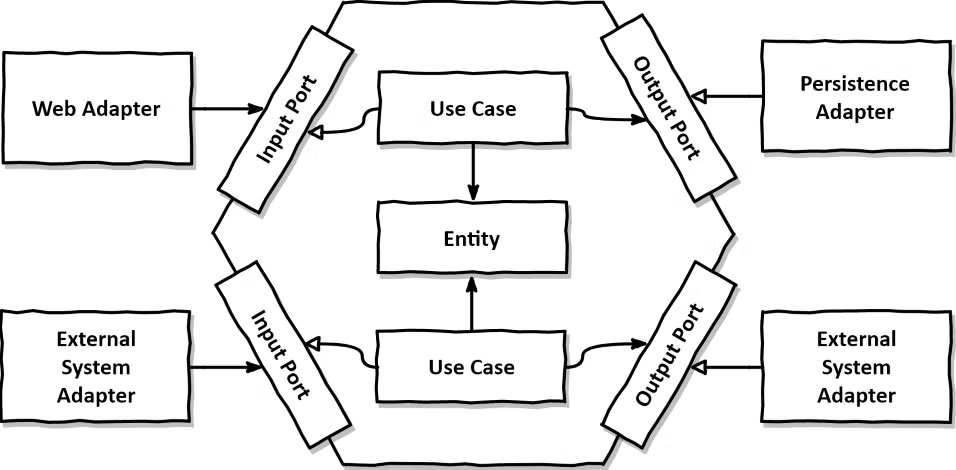
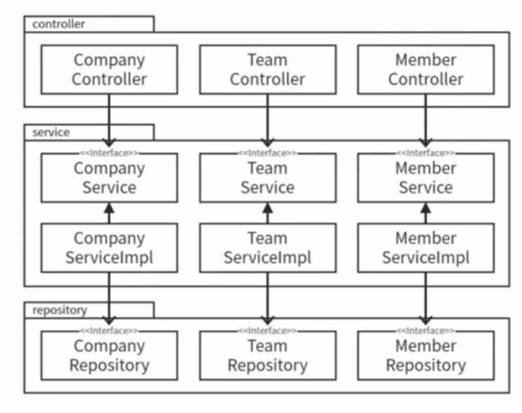
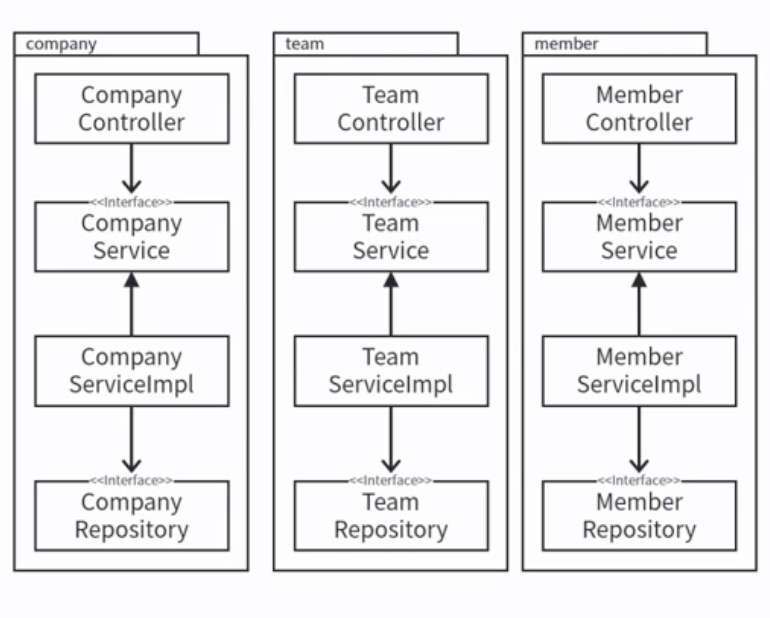
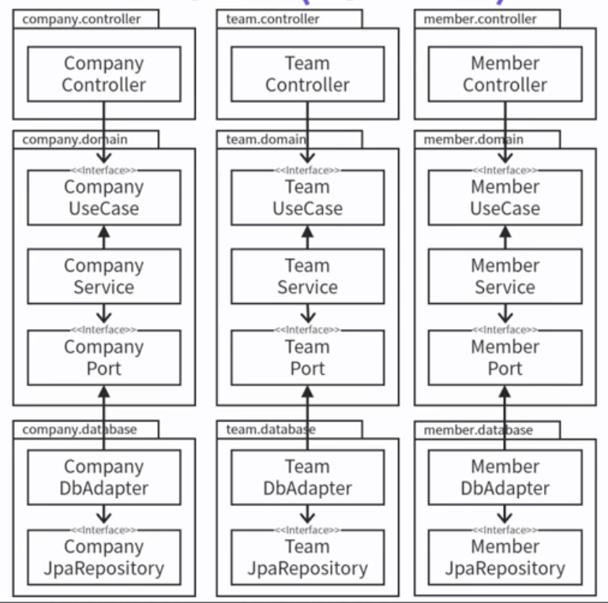

# 클린 아키텍처, 왜 중요할까?

우리가 만나는 대부분의 코드는 복잡하다.
특히 회사 실전 코드는 더더욱 복잡하다.

그 복잡한 코드에 새로운 기능을 추가한다고 생각해보자.
기능이 거의 없는 초기라면 일이 쉽지만, 그런 시절은 금방 지나간다.

결국 우리가 추구해야 하는 코드는
겉보기엔 복잡하더라도 **내부적으로 질서가 있고 구조 파악이 쉬운 코드**다.
즉, **확장성과 유지보수성이 높은 코드**다.

---

## 소프트웨어 아키텍처의 핵심 목표

소프트웨어 아키텍처는 기능을 어떤 구조에 담을 것인가에 대한 고민이다.

* 유지보수는 코드 읽기 → 이해 → 수정의 반복
* 목표는 **시스템 개발과 유지보수에 드는 인력과 비용을 최소화하는 것**

기능이 멀쩡해도 구조가 엉망이면
개발자가 수정하는 데 드는 비용이 기하급수적으로 늘어난다.
그러다 보면 결국 새 프로젝트를 파는 게 더 싸게 먹힌다는 비극이 발생한다.

---

# 좋은 아키텍처를 만들기 위한 재료

| 구성 요소         |
| ------------- |
| 패러다임          |
| 설계 원칙 (SOLID) |
| 컴포넌트 응집성 원칙   |
| 컴포넌트 결합 원칙    |

이 모든 것들을 자연스럽게 지키게 만들어주는 것이
바로 **아키텍처 패턴**이다.

---

# 대표 아키텍처 패턴

* 계층형 아키텍처
* 클린 아키텍처
* 헥사고날 아키텍처

이런 패턴을 따르면, 앞서 언급한 원칙을 강제하기 쉬워진다.

---

# 후보 비교

## 1) 계층형 아키텍처

전통적 수평 구조

> 웹 → 도메인 → 영속성

| 장점          | 단점            |
| ----------- | ------------- |
| 단순하고 익숙하다   | 도메인 표현이 약하다   |
| 초기 프로젝트에 적합 | 규모 커지면 정리 어려움 |
| 누구나 이해한다    | 조직적 성장에 취약    |

---

## 2) 클린 아키텍처

> 도메인이 중심. 의존성 역전 활용

| 장점          | 단점            |
| ----------- | ------------- |
| 규칙이 명확      | 구조가 복잡해질 수 있음 |
| DDD 적용 용이   | 적응에 시간이 필요    |
| 비즈니스 로직에 집중 | 레퍼런스가 적음      |

---

# 클린 아키텍처란?

여러 아키텍처에서 좋은 점을 통합한 개념
핵심 철학은 아래 하나로 귀결된다.

> **의존성은 안쪽(고수준 정책)을 향해야 한다**

공통의 지향점: 관심사 분리

관련 패턴

* 헥사고날 아키텍처
* BCE
* DCI

---

# 헥사고날 아키텍처

클린 아키텍처를 실용적으로 구현한 형태에 가장 가깝다.
스프링 백엔드에서 특히 널리 사용된다.

핵심 요약

| 개념     | 설명                   |
| ------ | -------------------- |
| 도메인    | 비즈니스 중심              |
| 포트     | 도메인과 외부 세계 연결규약      |
| 어댑터    | 외부 기술 요소를 끼워맞추는 변환장치 |
| 의존성 방향 | 항상 도메인 중심으로 inward   |

---

## 계층형과 기능 기반, 헥사고날 비교

### 계층형 아키텍처

* 컨트롤러, 서비스, 레포지토리로 나눈 익숙한 그 구조

---

### 기능 기반 패키지 구조

장점

* 도메인 개념이 눈에 잘 보임

단점

* 수평 계층 분리가 느슨해지며 복잡해질 수 있음

---

### 포트·어댑터 기반 구조 (헥사고날)

장점

* 도메인이 외부 기술에 의존하지 않음
* 테스트하기 쉽다

단점

* 패키지 수와 클래스 레이어가 더 많아진다
* 러닝 커브가 있다

---

# 아키텍처 도입 판단 기준

| 질문                          |
| --------------------------- |
| 개발 및 유지보수 인력을 줄일 수 있는가      |
| 의존성이 도메인 쪽으로 향하는가           |
| 기술 변경에도 도메인은 안전한가           |
| 테스트가 쉬운가                    |
| 아키텍처 원칙이 구조 안에서 자연스럽게 지켜지는가 |

주의할 점

* 소규모 프로젝트에서는 오히려 과할 수 있음
* 팀 전체의 이해와 합의가 필수

---

# 결론

외부 기술은 언제든 바뀐다.
하지만 비즈니스 규칙은 쉽게 변할 수 없다.

그렇다면 보호해야 할 것은 무엇인가.
바로, **도메인**이다.

클린 아키텍처는 그 보호막이며
그중 가장 현실과 타협이 잘 된 접근이

**헥사고날 아키텍처**다.

도메인을 외부의 변화로부터 격리하고
코드는 질서정연한 도시처럼 확장할 수 있어야 한다.
그 길의 시작점에 헥사고날이 있다.  

