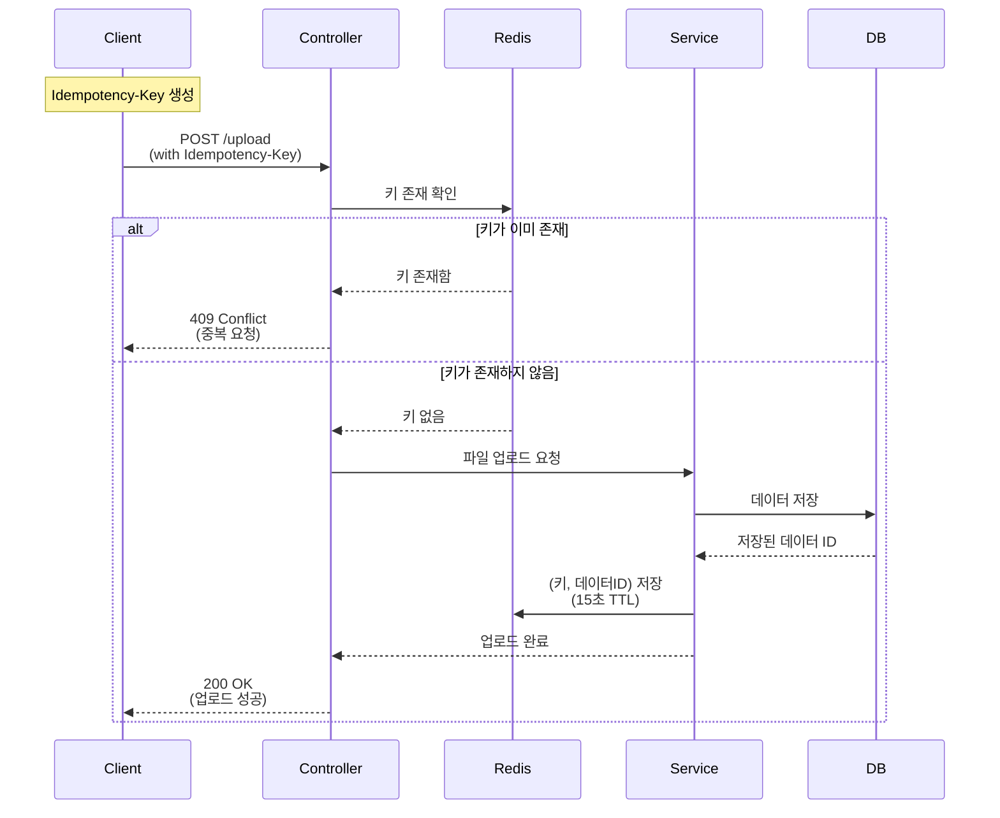

# HTTP 멱등성과 Redis를 활용한 중복 요청 방지 구현하기

## 멱등성(Idempotency)이란?

멱등성은 동일한 작업을 여러 번 수행하더라도 결과가 처음 한 번 수행한 결과와 동일한 것을 의미한다. 예를 들어 절대값 함수 abs(-1)은 몇 번을 수행하더라도 항상 1이라는 같은 결과가 나온다.

## HTTP 메서드와 멱등성

HTTP 메서드별 멱등성은 다음과 같다:

- 멱등성 O: GET, PUT, DELETE, HEAD, OPTIONS, TRACE
- 멱등성 X: POST, PATCH, CONNECT

GET 요청은 리소스를 조회만 하므로 몇 번을 호출해도 같은 결과가 보장된다. PUT은 전체 리소스를 대체하는 작업이므로, 여러 번 호출해도 최종 결과는 동일하다. 반면 POST는 호출할 때마다 새로운 리소스가 생성될 수 있어 멱등성이 보장되지 않는다.

## Redis를 활용한 멱등성 구현

클라이언트의 중복 요청을 방지하기 위해 Redis를 활용한 멱등성 구현 방법을 소개한다.



### 핵심 구현 코드

```java
@Component
@RequiredArgsConstructor
public class IdempotencyKeyProvider {
    private final RedisTemplate<String, Object> redisTemplate;

    // 키 검증
    public void validateKey(String key) {
        if (redisTemplate.hasKey(key)) {
            throw new ConflictException("중복 요청입니다");
        }
    }

    // 키 저장 (TTL 15초)
    public void setKey(String key, Long dataId) {
        redisTemplate.opsForValue()
            .set(key, dataId, 15, TimeUnit.SECONDS);
    }
}

```

### 컨트롤러에서의 사용

```java
@PostMapping("/upload")
public ResponseEntity<?> upload(
    @RequestHeader("Idempotency-Key") String key,
    @RequestBody UploadRequest request
) {
    // 1. 멱등성 키 검증
    idempotencyKeyProvider.validateKey(key);

    // 2. 비즈니스 로직 수행
    Data savedData = dataService.upload(request);

    // 3. 멱등성 키 저장
    idempotencyKeyProvider.setKey(key, savedData.getId());

    return ResponseEntity.ok(savedData);
}

```

## 에러 처리

멱등성 키 관련 주요 에러 케이스는 다음과 같다:

1. 키가 없거나 형식이 잘못된 경우: 400 Bad Request
2. 중복 요청인 경우: 409 Conflict
3. 동일 키로 다른 내용의 요청이 온 경우: 422 Unprocessable Entity

## 구현시 고려사항

1. **TTL 설정**: Redis에 저장되는 키의 만료 시간을 적절히 설정해야 한다. 너무 짧으면 실제 중복 요청을 막지 못하고, 너무 길면 불필요한 메모리가 낭비된다.
2. **키 생성 전략**: UUID나 타임스탬프 조합 등을 활용해 충분히 유니크한 값을 사용해야 한다.
3. **장애 대응**: Redis 장애 상황에 대한 fallback 전략이 필요하다.

## 마무리

Redis를 활용한 멱등성 구현은 분산 환경에서도 효과적으로 중복 요청을 방지할 수 있는 방법이다. 특히 파일 업로드나 결제와 같이 중복 처리되면 안 되는 중요한 기능에서 필수적으로 고려해야 할 패턴이다.

이 구현은 높은 성능과 함께 시스템의 안정성을 보장할 수 있어 실제 프로덕션 환경에서도 널리 사용되고 있다.
