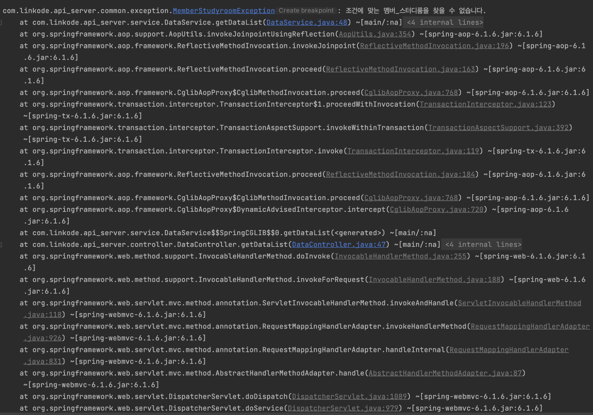
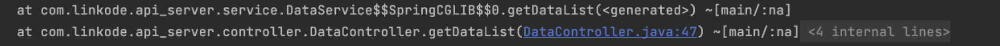

# 터진 예외로 스프링 작동흐름 맛보기

프로젝트를 진행하면서, 클라이언트 측에 적절한 예외상황을 알리기위해 예외처리 작업 + 테스트 중이었다.  



스프링부트 서버에서는 예외가 하나 터지면 저렇게 많은 메세지가 생성된다.  
평소였다면 그냥 무시했을 메세지들이었겠지만, 이 메시지들은 그자체로 스프링 부트가 어떻게 HTTP 통신을 하고있는지 담고있기때문에  
간단하게 살펴보기로 했다.  ( 모든 메세지말고 중요한 메세지만... )

우선 로그 순서는 실제로 예외가 발생한 시점에서 호출 스택을 나타내며, 호출 순서와 반대 순서로 표시된다.

하지만 우리는 로그를 위에서 부터 읽어보겠다! ㅎㅎ  

```
com.linkode.api_server.common.exception.MemberStudyroomException: 조건에 맞는 멤버_스터디룸을 찾을 수 없습니다.
at com.linkode.api_server.service.DataService.getDataList(DataService.java:48) ~[main/:na]
```
먼저 MemberStudyroomException이라는 커스텀 예외이다.  
두 번째 줄에서 해당 예외가 DataService의 getDataList 메서드에서 발생했음을 알 수 있다.


다음 부분은 AOP 및 트랜잭션 관리에 관한 부분이다. 하나 하나 살펴보자면  
- `AopUtils.invokeJoinpointUsingReflection` 이 부분에서 알 수 있듯이 Spring AOP는 메서드를 Reflection을 통해 호출한다.  
- `CglibAopProxy.proceed`에서 보면 CGLIB를 사용하여 생성된 AOP 프록시가 메서드 호출을 하는 것을 볼 수 있다.  
- `TransactionInterceptor.proceedWithInvocation` 이 부분은  트랜잭션 경계를 설정하고, 메서드 실행 후 트랜잭션을 커밋 또는 롤백하는 부분이다.  


```
at com.linkode.api_server.controller.DataController.getDataList(DataController.java:47) ~[main/:na]
```
컨트롤러 호출 부분이다. DataController.getDataList 메서드를 호출하는 것을 확인 할 수 있다.  
이 메서드를 통해 서비스 계층인 DataService.getDataList를 호출하는 것을 확인할 수 있다.  

  
```
at org.springframework.web.method.support.InvocableHandlerMethod.doInvoke(InvocableHandlerMethod.java:255) ~[spring-web-6.1.6.jar:6.1.6]
at org.springframework.web.method.support.InvocableHandlerMethod.invokeForRequest(InvocableHandlerMethod.java:188) ~[spring-web-6.1.6.jar:6.1.6]
at org.springframework.web.servlet.mvc.method.annotation.ServletInvocableHandlerMethod.invokeAndHandle(ServletInvocableHandlerMethod.java:118) ~[spring-webmvc-6.1.6.jar:6.1.6]
at org.springframework.web.servlet.mvc.method.annotation.RequestMappingHandlerAdapter.invokeHandlerMethod(RequestMappingHandlerAdapter.java:926) ~[spring-webmvc-6.1.6.jar:6.1.6]
at org.springframework.web.servlet.mvc.method.annotation.RequestMappingHandlerAdapter.handleInternal(RequestMappingHandlerAdapter.java:831) ~[spring-webmvc-6.1.6.jar:6.1.6]

```
Spring MVC 핸들러 어댑터가 작동하는 부분이다.  
`InvocableHandlerMethod.doInvoke`는 살제 컨트롤러 메서드를 호출하는 부분이다.
`ServletInvocableHandlerMethod.invokeAndHandle` 요청을 적절한 컨트롤러 메서드에 디스패치하는 부분이다. 
`RequestMappingHandlerAdapter.invokeHandlerMethod` 여기서 컨트롤러 메서드를 호출한다.  


마지막으로 (사실 마지막은 아니지만..뒤에 시큐리티나 여러 인가를 하는 로그가 있지만 오늘은 여기까지만 살펴보겠다..! HTTP이 스프링에서 처리되는 흐름을 보는게 목표이니까!)

```
at org.springframework.web.servlet.DispatcherServlet.doDispatch(DispatcherServlet.java:1089)
at org.springframework.web.servlet.DispatcherServlet.doService(DispatcherServlet.java:979)
at org.springframework.web.servlet.FrameworkServlet.processRequest(FrameworkServlet.java:1014)
at org.springframework.web.servlet.FrameworkServlet.doGet(FrameworkServlet.java:903)

```
이 부분은 Spring MVC의 프론트 컨트롤러인 DispatcherServlet이 HTTP 요청을 받아서 처리하는 부분이다!   
여기서 `doDispatch` 메서드가 요청을 적절한 핸들러로 디스패치한다.

여기서 눈에 띄는점은 `DispatcherServlet, RequestMappingHandlerAdapter, ServletInvocableHandlerMethod, InvocableHandlerMethod`
모두  HTTP 요청을 처리하고 적절한 컨트롤러 메서드를 호출하는데 쓰인다는 것이다.  

그렇다 이들은 서로 상호연관되어 요청 처리의 특정 단계를 담당한다.  

[스프링 작동원리 기본](https://github.com/Mouon/Mouon-SpringBoot-STUDY) 에서도 살펴보았듯 Spring MVC 요청 처리 흐름은 다음과 같다.  

1. DispatcherServlet: Spring MVC의 프론트 컨트롤러로, 모든 HTTP 요청을 받아서 처리. 
2. Handler Mapping: 요청 URL을 기반으로 적절한 컨트롤러를 찾음. 
3. Handler Adapter: 찾은 컨트롤러를 실행할 수 있는 적절한 어댑터를 사용하여 요청을 처리. 

로그에 나타난 메서드들이 어떻게 요청을 처리하는 간단한 예시를 통해 일아보겠다.  

## DispatcherServlet.doDispatch
```java
protected void doDispatch(HttpServletRequest request, HttpServletResponse response) throws Exception {
        HttpServletRequest processedRequest = request;
        HandlerExecutionChain mappedHandler = null;
        boolean multipartRequestParsed = false;

        WebAsyncManager asyncManager = WebAsyncUtils.getAsyncManager(request);

        try {
        ModelAndView mv = null;
        Exception dispatchException = null;

        try {
        processedRequest = checkMultipart(request);
        multipartRequestParsed = (processedRequest != request);

        // 요청에 패핑되는 HandlerMapping (HandlerExecutionChain) 조회
        mappedHandler = getHandler(processedRequest);
        if (mappedHandler == null) {
        noHandlerFound(processedRequest, response);
        return;
        }

        // 요청을 처리할 HandlerAdapter 조회
        HandlerAdapter ha = getHandlerAdapter(mappedHandler.getHandler());

        ...

        // HandlerAdapter를 통해 컨트롤러 메소드 호출(HandlerExecutionChain 처리)
        mv = ha.handle(processedRequest, response, mappedHandler.getHandler());

        ... // 후처리 진행
        }

```
doDispatch의 전부를 살펴보진 않겠다. 대표적인 것만 보자면  
여기서 `getHandler`를 통해 요청을 처리할 핸들러(컨트롤러)를 찾는다.    
또한 `getHandlerAdapter`를 통해 핸들러를 실행할 어댑터를 찾는다.  그리고 `ha.handle`를 통해 실제로 핸들러 메서드를 실행한다.  
여기서 `RequestMappingHandlerAdapter`의 `handle 메서드`가 호출된다.  

그렇다면 이제! `RequestMappingHandlerAdapter.handle`의 구조를 살펴보자!  

## RequestMappingHandlerAdapter.handle
```java
public final ModelAndView handle(HttpServletRequest request, HttpServletResponse response, Object handler) throws Exception {
return invokeHandlerMethod(request, response, (HandlerMethod) handler);
}
```
`HttpServletRequest request`를 통해 클라이언트로부터의 HTTP 요청 객체를 받고, `HttpServletResponse response`를 통해 클라이언트로의 HTTP 응답 객체를 받는다.  
Object handler는 요청을 처리할 핸들러 객체이고 ModelAndView는 뷰와 모델을 포함하는 객체로, 컨트롤러의 처리 결과를 나타낸다.  

결론적으로 handle 메서드는 invokeHandlerMethod를 호출하여 실제 컨트롤러 메서드를 실행한다.  

## RequestMappingHandlerAdapter.invokeHandlerMethod
아래는 `RequestMappingHandlerAdapter.invokeHandlerMethod`이다.

```java
protected ModelAndView invokeHandlerMethod(HttpServletRequest request, HttpServletResponse response, HandlerMethod handlerMethod) throws Exception {
    ServletInvocableHandlerMethod invocableMethod = createInvocableHandlerMethod(handlerMethod);
    invocableMethod.invokeAndHandle(webRequest, mavContainer);
    return mavContainer.getModelAndView();
}
```
createInvocableHandlerMethod를 통해 ServletInvocableHandlerMethod 객체를 생성하고  
invokeAndHandle를 통해 실제 컨트롤러 메서드를 호출하여 요청을 처리한다.  

### ServletInvocableHandlerMethod.invokeAndHandle
요청을 적절한 컨트롤러 메서드에 디스패치하는 역할을 한다.
```java
public void invokeAndHandle(ServletWebRequest webRequest, ModelAndViewContainer mavContainer, Object... providedArgs) throws Exception {
    Object returnValue = invokeForRequest(webRequest, mavContainer, providedArgs);
    setResponseStatus(webRequest);
    // 생략...생략..생략..
    mavContainer.setRequestHandled(true);
}


```
invokeForRequest 부분이 실제 컨트롤러 메서드를 호출하는 부분이다.  
setResponseStatus은  응답 상태를 설정한다.  

### InvocableHandlerMethod.invokeForRequest
```java

public Object invokeForRequest(NativeWebRequest request, ModelAndViewContainer mavContainer, Object... providedArgs) throws Exception {
    Object[] args = getMethodArgumentValues(request, mavContainer, providedArgs);
    return doInvoke(args);
}


```
`doInvoke`가 `Java Reflection`을 사용하여 실제 컨트롤러 메서드를 호출한다.

### InvocableHandlerMethod.doInvoke

```java
@Nullable
protected Object doInvoke(Object... args) throws Exception {
    return this.method.invoke(this.bean, args);
}

```
Java Reflection을 사용하여 컨트롤러 메서드를 호출한다!

정리하자면 아래와 같다.  
### 1. handle 메서드 호출
RequestMappingHandlerAdapter.handle 메서드는  
HTTP 요청을 처리하기 위해 invokeHandlerMethod를 호출한다.
### 2. invokeHandlerMethod 메서드 호출  
invokeHandlerMethod는 ServletWebRequest와  ModelAndViewContainer 객체를 생성한다.  
HandlerMethod를 기반으로 ServletInvocableHandlerMethod 객체를 생성하고, 필요한 설정을 진행한다.  
invocableMethod.invokeAndHandle 메서드를 호출하여 실제 컨트롤러 메서드를 실행하고, 결과를 처리한다.
### 3. 컨트롤러 메서드 호출 및 결과 처리
ServletInvocableHandlerMethod.invokeAndHandle 메서드는 
invokeForRequest와 doInvoke 메서드를 통해 실제 컨트롤러 메서드를 호출한다.
컨트롤러 메서드의 실행 결과를 ModelAndViewContainer에 담고, 이를 ModelAndView로 변환하여 반환한다.  

### 이제 마지막으로 로그를 역순으로 HTTP 흐름을 살펴보겠다.

## DispatcherServlet.doDispatch
```
at org.springframework.web.servlet.DispatcherServlet.doDispatch(DispatcherServlet.java:1089)
at org.springframework.web.servlet.DispatcherServlet.doService(DispatcherServlet.java:979)
at org.springframework.web.servlet.FrameworkServlet.processRequest(FrameworkServlet.java:1014)
at org.springframework.web.servlet.FrameworkServlet.doGet(FrameworkServlet.java:903)
```
- DispatcherServlet은 스프링 MVC의 프론트 컨트롤러로 모든 HTTP 요청을 받아서 처리
- doDispatch 메서드가 요청을 적절한 핸들러로 디스패치.

## RequestMappingHandlerAdapter.handleInternal
```
at org.springframework.web.servlet.mvc.method.annotation.RequestMappingHandlerAdapter.handleInternal(RequestMappingHandlerAdapter.java:831)
at org.springframework.web.servlet.mvc.method.annotation.RequestMappingHandlerAdapter.invokeHandlerMethod(RequestMappingHandlerAdapter.java:926)
```
- RequestMappingHandlerAdapter는 컨트롤러 메서드를 호출하기 위해 적절한 핸들러 메서드를 찾아 실행. 
- invokeHandlerMethod 메서드는 실제 컨트롤러 메서드를 실행합.

## ServletInvocableHandlerMethod.invokeAndHandle
```
at org.springframework.web.servlet.mvc.method.annotation.ServletInvocableHandlerMethod.invokeAndHandle(ServletInvocableHandlerMethod.java:118)
at org.springframework.web.method.support.InvocableHandlerMethod.invokeForRequest(InvocableHandlerMethod.java:188)
at org.springframework.web.method.support.InvocableHandlerMethod.doInvoke(InvocableHandlerMethod.java:255)
```

- ServletInvocableHandlerMethod는 실제 컨트롤러 메서드를 호출하여 요청을 처리. 
- invokeAndHandle 메서드는 요청을 적절한 컨트롤러 메서드에 디스패치하는 역할을 함.

## DataController.getDataList
```
at com.linkode.api_server.controller.DataController.getDataList(DataController.java:47)
```

컨트롤러의 getDataList 메서드는 서비스 계층의 getDataList 메서드를 호출.

## DataService.getDataList
```
at com.linkode.api_server.service.DataService.getDataList(DataService.java:48)
```
- 서비스 계층의 getDataList 메서드가 실제 비즈니스 로직을 처리. 

## AOP 및 트랜잭션 관리
```
at org.springframework.aop.framework.ReflectiveMethodInvocation.proceed(ReflectiveMethodInvocation.java:163)
at org.springframework.transaction.interceptor.TransactionInterceptor.invoke(TransactionInterceptor.java:119)
at org.springframework.aop.framework.ReflectiveMethodInvocation.proceed(ReflectiveMethodInvocation.java:184)
at org.springframework.aop.framework.CglibAopProxy$CglibMethodInvocation.proceed(CglibAopProxy.java:768)
at org.springframework.aop.framework.CglibAopProxy$DynamicAdvisedInterceptor.intercept(CglibAopProxy.java:720)
```

- AOP와 트랜잭션 관리가 적용된 부분. 
- AOP는 메서드를 프록시로 감싸서 호출함
- 트랜잭션 인터셉터는 트랜잭션 경계를 설정하고 커밋 또는 롤백을 처리.

## MemberStudyroomException 예외 발생
```
com.linkode.api_server.common.exception.MemberStudyroomException: 조건에 맞는 멤버_스터디룸을 찾을 수 없습니다.
at com.linkode.api_server.service.DataService.getDataList(DataService.java:48) ~[main/:na]
```

로그의 마지막 부분은 MemberStudyroomException 예외가 발생한 부분이다. 
이는 DataService의 getDataList 메서드에서 발생했다. 

---------------------------

# 급하게 마무리
지금까지 통해 로그를 살펴보며 간단하게 스프링의 작동 흐름을 살펴보았습니다!


