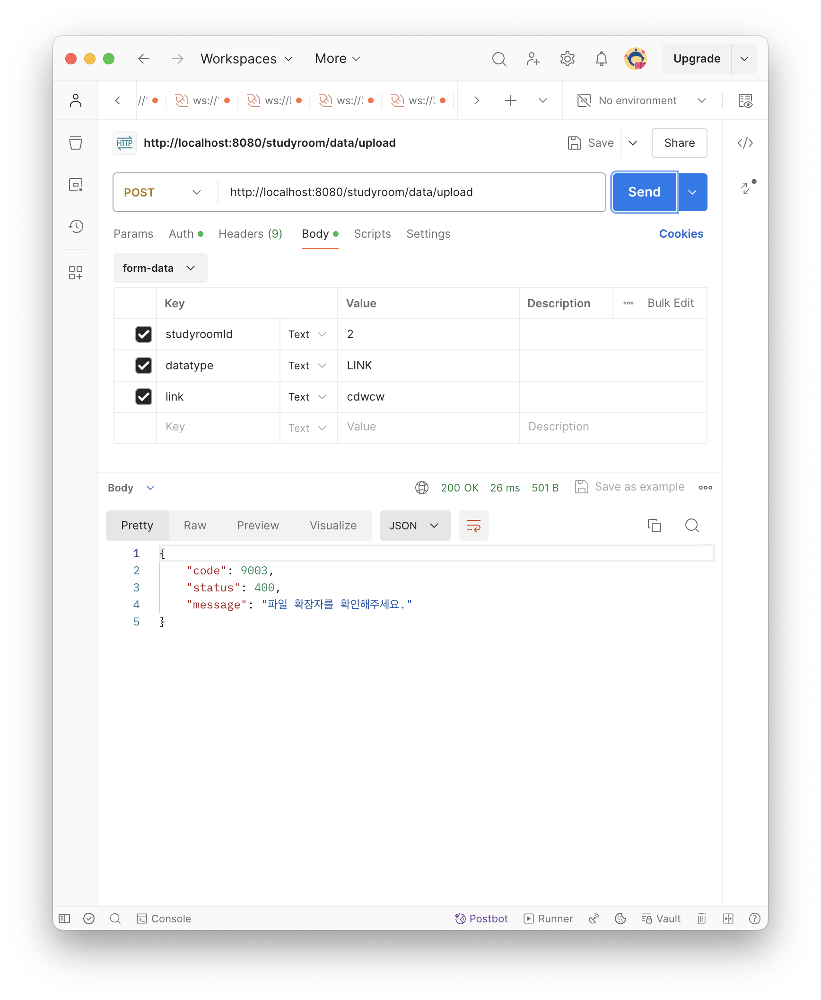

# 프로젝트에서 파일 검증로직 만들기

###### 이번 글은 정말 기록용이다. `validater(파일 검증기)`를 구현할떄 사용한 문법과 나의 생각의 흐름 그리고 마주했던 트러블들을 기록하고자 하는 마음에 작성하게 되었다.

진행 중인 프로젝트에서는 파일을 사용자로부터 타입별로 분류해서 업로드 받고 저장소의 URL을 DB에 저장한다.  
이떄 타입에따른 파일의 유형을 검증할 필요성이 생겼다.  
사실 클라이언트 측에서도 가능한 부분이다. 하지만 서버와 클라이언트 양측에서 모두 검증을 진행하는 것이 시스템의 안정성을 보장하는것에 맞다고 판단하여 서버측에도 검증 로직을 추가하기로 하였다.  

먼저 `FileValidater`라는 클래스를 util폴더에 별도로 생성해준다. 이렇게 별도로 생성해주면 추 후에 다른 클래스에서 필요할 시 해당 클래스를 주입받아서 사용하면 되기때문에  
재사용성이 높아진다.  

여기서 고민이 생겼다. 첫 번째 고민은 확장자를 어떻게 추출하는지에 대한 것이다.  
두 번째 고민은 확장자를 어떤형태로 저장할 것인가이다.  
세번째 고민은 링크는 확장자가 아니라 별도의 검증로직이 필요한데 이것에대한 고민이었다.  
마지막 고민은 위의 고민들을 모두 해결하는 코드를 작성하되 어떻게 가독성이 높은 코드를 작성하냐이다.  

맨 처음 들은 생각은 `if문`으로 링크와 확장자의 검증 로직을 구현하는 것이었다. 하지만 이렇게 작성하게 되면   
if문 내부의 조건이 너무 길어지며 코드가 `Nesting`이 너무 많이 일아나 가독성을 해친다는 점이었다.  

우리는 사용자가 업로드한 파일이 데이터 타입에 맞는 파일의 확장자 목록 포함되는지만 확인해서 포함되면 참 포함되지않으면 거짓을 반환하면 된다.  
때문에 contains를 지원하는 Set(집합) 을 사용하면 된다는 것을 생각해낼 수 있었다.  
먼저 이미지와 일반 파일에대한 집합을 만들어줬다.  

```java
@RequiredArgsConstructor
@Component
@Slf4j
public class FileValidater {
    /** 집합으로 정의 */
    private static final Set<String> IMAGE_EXTENSIONS = new HashSet<>();
    private static final Set<String> FILE_EXTENSIONS = new HashSet<>();
}

```

이제 해당 집합들을 초기화해야한다.  
클래스 전역으로 해당 집합을 초기화하기위해 static을 활용했다.  
```java

public class FileValidater {
    /** 집합으로 정의 */
    private static final Set<String> IMAGE_EXTENSIONS = new HashSet<>();
    private static final Set<String> FILE_EXTENSIONS = new HashSet<>();

    static {
        IMAGE_EXTENSIONS.add("png");
        IMAGE_EXTENSIONS.add("jpg");
        IMAGE_EXTENSIONS.add("jpeg");
        IMAGE_EXTENSIONS.add("svg");
        IMAGE_EXTENSIONS.add("gif");
        IMAGE_EXTENSIONS.add("TIFF");
        IMAGE_EXTENSIONS.add("HEIC");

        FILE_EXTENSIONS.add("pdf");
        FILE_EXTENSIONS.add("ppt");
        FILE_EXTENSIONS.add("pptx");
        FILE_EXTENSIONS.add("doc");
        FILE_EXTENSIONS.add("docx");
        FILE_EXTENSIONS.add("txt");
        FILE_EXTENSIONS.add("c");
        FILE_EXTENSIONS.add("cpp");
        FILE_EXTENSIONS.add("java");
        FILE_EXTENSIONS.add("html");
        FILE_EXTENSIONS.add("css");
        FILE_EXTENSIONS.add("js");
        FILE_EXTENSIONS.add("hwp");
        FILE_EXTENSIONS.add("xls");
        FILE_EXTENSIONS.add("xlsx");
        FILE_EXTENSIONS.add("xltm");
        FILE_EXTENSIONS.add("cvs");
    }
}

```

우선 최대한 확장자를 추가해 두었다.. 
사실 집합을 사용하면 좋은이유가 또 있는데,  
집합은 요소들에 대한 추가 삭제가 간편해서
추후에 확장자를 추가하거나 삭제하는 것을 간편하게 할 수 있다.  

이제 해당 집합을 이용해서 검증을 하는 메서드를 만들기전에 URL에 대한 검증 메서드를 먼저 만들어야한다.  
Set의 contains와 일관된 로직 흐름을 갖게하기위해 URL메서드 또함 boolean으로 URL형식이 맞으면 true 일치하지않으면 false를 반환하도록 구현하였다.  

URL검증에는 정규식을 이용하였다.  
```java
    /** URL은 별도로 검증 */
    public boolean validateUrl(String url) {
        log.info("FileValidater.validateUrl");
        String urlRegex = "^(https|http)://[^\\s/$.?#].[^\\s]*$";
        return url.matches(urlRegex);
    }

```

정규식의 의미는 간단하게 `http`나 `https`로 시작해야하며, `://`가 그 이후에 배치되어야 하고  
그 이후에는 공백이나 '?' 또는 '.','#' 등이 올 수 없음을 의미한다. 그리고 그 이후에는 마지막 '.'이 오며 
공백이 올 수 없음을 의미한다.  

다음으로는 확장자를 추출하는 메서드를 만들었다.  
해당 메서드에는 split을 활용할 까 했지만. String에는 lastIndexOf, substring 등을 제공하여 확장자를 간단하고 
가독성 좋게 추출하는 법이 있음을 할게되어 해당 방식으로 구현하게 되었다.  
```java

    public String getFileExtension(String fileName){
        log.info("FileValidater.getFileExtension");
        log.info("fileExtension : "+fileName.substring(fileName.lastIndexOf(".") + 1));
        if (fileName == null || fileName.lastIndexOf(".") == -1) {
            return "";
        }
        return fileName.substring(fileName.lastIndexOf(".") + 1);
    }
    
```

먼저 이 메서드는 파일이름이 전달 되지않았거나 .이 파일 이름에 없으면 빈 문자열을 반환하도록 구현하였다.  
(빈문자열은 contains에서 false를 뱉게 되어있다 ㅎㅎㅎ)  
마지막 줄이 핵심인데, 파일이름에서 마지막 '.'의 인덱스를 알아내어 그 이후의 문자열만 추출하도록 하는 부분이다. 
`fileName.substring(fileName.lastIndexOf(".") + 1)`
substring은 주어진 인덱스 부터 문자열 끝까지 반환하므로 '.'을 포함하지 않게하기위해 '+ 1'을 하여 `substring`에 전달하였다.  

이제 마지막으로 주어진 메서드들을 조합하여 파일이름과 타입기반으로 확장자를 검증하는 로직을 완성시켜 보겠다!
```java

    public boolean validateFile(String filename, DataType dataType){
        String extension = getFileExtension(filename);
        switch (dataType) {
            case IMG:
                return IMAGE_EXTENSIONS.contains(extension.toLowerCase());
            case FILE:
                return FILE_EXTENSIONS.contains(extension.toLowerCase());
            case LINK:
                return validateUrl(filename);
            default:
                return false;
        }
    }

```

`switch` 문을 확용하여 타입별로 검증을 수행하였다.  
`IMG`,`FILE`타입에는 Set의 contains를 활용하였고 `LINK`타입에 대해서는 별도로 구현해둔  
validateUrl을 사용하였다.  

이제 `FileValidater` 클래스는 완성되었다.  

끝이 아니다. 원래 검증로직은 어느 시점에 도입하냐에따라 무용지물이 될 수 도있고, 역할을 잘 수행할 수 도있다.  
지금부터는 논리가 중요하다. 

파일 검증이 필요한 `DataService`로 가보자  


`DataService`에는 `extractDataNameAndUrl` 라는 파일 이름과 파일의 URL을 추출하는 메서드가 있다.  
```java

    /** 이름과 URL 추출 */
    private String[] extractDataNameAndUrl(UploadDataRequest request){
        log.info("[DataService.extractDataNameAndUrl]");
        DataType dataType = request.getDataType();
        if(dataType.equals(DataType.LINK) && request.getLink() != null){
            String dataName = request.getLink();
            String dataUrl = request.getLink();
            return new String[]{dataName,dataUrl};
        }else if (request.getFile() != null) {
            String dataName = request.getFile().getOriginalFilename();
            String dataUrl = s3Uploader.uploadFileToS3(request.getFile(), S3_FOLDER);
            return new String[]{dataName,dataUrl};
        }
        else {
            throw new DataException(NONE_FILE);
        }
    }

```

해당 메서드의 흐름을 살펴보자, 해당메서드는 우선 파일 유형이 LINK이냐 아니냐에 따라 다르게 동작하며 파일이 없을 시에는
`DataException`의 `NONE_FILE`예외를 던지도록 구성되어있다.  
그렇다면 반복도 줄이고 `dataName`이 모두 초기화된 시점인 마지막 부분에 검증로직을 추가할까?

추가해보겠다.  

```java

    private String[] extractDataNameAndUrl(UploadDataRequest request){
        log.info("[DataService.extractDataNameAndUrl]");
        DataType dataType = request.getDataType();
        if(dataType.equals(DataType.LINK) && request.getLink() != null){
            String dataName = request.getLink();
            String dataUrl = request.getLink();
            return new String[]{dataName,dataUrl};
        }else if (request.getFile() != null) {
            String dataName = request.getFile().getOriginalFilename();
            String dataUrl = s3Uploader.uploadFileToS3(request.getFile(), S3_FOLDER);
            return new String[]{dataName,dataUrl};
        }
        else {
            throw new DataException(NONE_FILE);
        }
        
        if(!fileValidater.validateFile(dataName,dataType)){
            throw new DataException(INVALID_EXTENSION);
        }
    }

```

얼핏보면 잘 작동하는 것같고 응답또한 정상적으로 예외상황에서 예외를 던지는 것 같다.  

  

하지만 여기에는 심각한 논리적 허점이있다.  
그것은 바로 `String dataUrl = s3Uploader.uploadFileToS3(request.getFile(), S3_FOLDER);`이 부분이다.  
링크자료가 아닌이상 파일의 URL은 S3에 업로드한 후 그 저장소의 URL을 반환받는다.  
때문에 프로젝트 서버에서 DB에 저장하는 것은 예외를 던져 막지만 S3버킷에는 저장되는 문제가 발생하는 것이다.  

그렇기 때문에 `dataName`을 받은시점에 바로 검증을 해야한다.  
하지만 아래 로직은 그렇게되면 반복되기떄문에 별도의 메서드로 분리하기로했다.  
```java

        if(!fileValidater.validateFile(dataName,dataType)){
            throw new DataException(INVALID_EXTENSION);
        }

```

아래와 같이 `validateData`라는 메서드를 생성하여 해당로직을 분리하였다.  

```java
    /** 이름과 타입으로 확장자 검사 */
    private void validateData(String dataName, DataType dataType){
        log.info("[DataService.validateData]");
        if(!fileValidater.validateFile(dataName,dataType)){
            throw new DataException(INVALID_EXTENSION);
        }
    }
```

이제 이 메서드를 `extractDataNameAndUrl`에 삽입하겠다.  
```java

    /** 이름과 URL 추출 */
    private String[] extractDataNameAndUrl(UploadDataRequest request){
        log.info("[DataService.extractDataNameAndUrl]");
        DataType dataType = request.getDataType();
        if(dataType.equals(DataType.LINK) && request.getLink() != null){
            String dataName = request.getLink();
            validateData(dataName,dataType);
            String dataUrl = request.getLink();
            return new String[]{dataName,dataUrl};
        }else if (request.getFile() != null) {
            String dataName = request.getFile().getOriginalFilename();
            validateData(dataName,dataType);
            String dataUrl = s3Uploader.uploadFileToS3(request.getFile(), S3_FOLDER);
            return new String[]{dataName,dataUrl};
        }
        else {
            throw new DataException(NONE_FILE);
        }
    }

```

아렇게 되면 파일과 링크를 정상적으로 검증하며 S3저장소에 업로드 되는 과정도 프로젝트에서 요구하는 예외상황에 맞추어서 발생하게된다.  

최종적으로 데이터를 업로드하는 비즈니스 로직을 수행하는 메서드를 완성하면 다음과 같다.  
```java
@Transactional
public Data saveData(String dataName, DataType dataType, String dataUrl, Member member, Studyroom studyroom) {

        Data data = Data.builder()
        .dataName(dataName)
        .dataType(dataType)
        .status(BaseStatus.ACTIVE)
        .studyroom(studyroom)
        .dataUrl(dataUrl)
        .member(member)
        .build();
        return dataRepository.save(data);
        }
        
@Transactional
public UploadDataResponse uploadData(UploadDataRequest request, long memberId) {
        // ... 짧은 유저 검증 로직 및 로그
        try {
        String[] dataInfo = extractDataNameAndUrl(request);
        String dataName=dataInfo[0];
        DataType dataType = request.getDataType();
        String dataUrl=dataInfo[1];
        Data savedData = saveData(dataName, dataType, dataUrl, memberstudyroom.getMember(), memberstudyroom.getStudyroom());
        
        return UploadDataResponse.builder()
        .dataId(savedData.getDataId())
        .dataUrl(savedData.getDataUrl())
        .dataType(savedData.getDataType())
        .dataName(savedData.getDataName())
        .build();

        } catch (NullPointerException e) {
        throw new DataException(NONE_FILE);
        }
        }

```

해당메서드는 유저의 정보를 검증하고 검증이 통과했다면 DB에 저장하는 기능을 수행한다.  

이번 기능을 구현하면서 백엔드에서 논리가 중요함을 다시한번 꺠닫게 된 경험이었던 것같다.  
효율적인 쿼리문 ,유의미한 로그, 유지보수 확장성과 가독성이 좋은 코드도 중요하지만 알고리즘을 공부하듯이 많은 상황을 고민해서 적절한 예외를 발생시켜 클라이언트에게 그 상황을 전파하는 논리력또한 
중요한 능력이지않을까 하는 생각을 해볼 수 있었던 좋은 경험이었다!  

  
  
  

### 2탄  
[파일검증기 예외처리 개선](https://github.com/Mouon/Mouon-SpringBoot-STUDY/blob/master/study/fileValidaterStudy/ImproveFilevalidater.md)  

