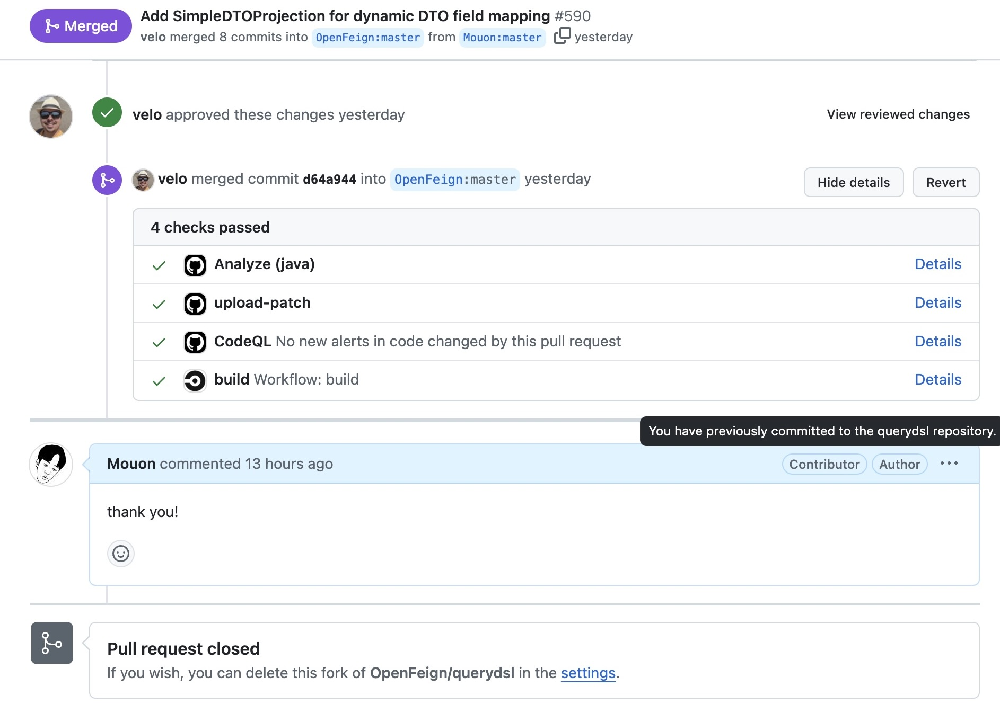

# 처음으로 오픈소스에 기여한 기록하다! : SimpleDTOProjection 구현  


  
이번에 처음으로 오픈소스 프로젝트에 기여하게 되었다. 기여한 오픈소스 프로젝트는 [QueryDSL](https://github.com/OpenFeign/querydsl)이라는 라이브러리인데, 여기서 나는 `SimpleDTOProjection`이라는 기능을 구현하였다.  


솔직히.... 이 기능을 구현할 때 QueryDSL 프로젝트의 모든 코드들을 명확히 이해하고 작성한 것은 아니었다.. (이해하기에 너무 많다.....)   
게다가 Java의 "Reflection" 이라는 기능을 이번에 처음 직접 다루어봤고, 이를 완전히 이해하지 못한 채로 구현에 나섰다... 하하... (마음이 너무 급했다...)  
처음에는 너무 막막해서 `FactoryExpressionBase`라는 추상 클래스를 참고하며 무작정 따라 쳤다.  

테스트를 만들어 검증을 까지 했지만 만든 코드가 잠재적인 문제없이 작동할지 확신도 없었고,  
단지 이런 기능이 있으면 좋겠다는 마음으로 PR을 보냈다...(PR이 거절되어도 누군가는 이런기능을 개발해주면 좋겠다는 마음에..)

### 구현 배경

QueryDSL에서 Projection을 통해 DTO 생성과 엔티티 필드 매핑을 하는 기존의 방식은 아래처럼 개별 필드를 하나하나 매핑해야 하는 방식이다. 
```java

    queryFactory.select(Projections.constructor(UserDTO.class, user.username, user.email))
            .from(user)
            .fetch();

```
나는 이 방식이 코드를 길어지게 만들어 좀 가독성을 떨어뜨린다고 생각했다.
따라서 개별 필드를 하나하나 매핑해야 하는 기존의 방식을 자동화하는 방법을 구현해보기로 하였다.  

### 기존 코드 구조

QueryDSL의 `FactoryExpression` 인터페이스는 다양한 프로젝션 방식(예: JavaBean, Constructor, fields)을 지원하고, 
이 인터페이스의 기본 구현체는 `FactoryExpressionBase`이다. 
이 클래스가 객체를 생성할 수 있는 기본 구조를 제공했기때문에, 
나는 이를 상속받아 원하는 기능을 구현해 보기로하였다. 

### 구현 내용

내가 구현한 클래스는 `SimpleDTOProjection` 클래스이다.
`SimpleDTOProjection` 클래스는 `FactoryExpressionBase`를 확장하여 DTO 객체와 그 필드를 동적으로 생성 및 매핑하는 역할을 한다. 
특히, `EntityPathBase` 타입의 엔티티에서 필드와 이름이 일치하는 부분을 찾아 자동으로 매핑하도록하였다.  

구현전에 너무 생소한 코드들이 많았다. 따라서 우선 쿼리가 실행되는 과정에서 `args`가 어떻게 받아오는지 이해해보기로했다.  

간단하게 요약하면, QueryDSL에서 쿼리를 실행한 후 결과를 DTO에 매핑할 때 `Projection` 같은 클래스를 사용하여 결과 값들을 **`args` 배열**로 넘기고,  
이를 통해 DTO를 생성하는 방식이다.

### 기존의 Projection이 DTO 매핑하는 과정

1. fetch() 메서드가 호출되면, QueryDSL은 데이터베이스로부터 결과를 받아온다.
2. 쿼리 결과의 각 행에 대해, 지정된 Projection(예: Projections.constructor)이 적용된다.  
3. 각 행의 데이터는 Projection에 지정된 순서대로 Object[] 배열(args)로 변환된다.
4. Projection은 이 args 배열을 사용하여 DTO 객체를 생성한다.

#### 예를 들어, Projections.constructor를 사용한 경우
```java
Projections.constructor(UserDTO.class, user.username, user.email)
```
이 Projection은 다음과 같이 동작한다

1. 쿼리 결과에서 username과 email 값을 추출한다.
2. 이 값들을 Object[]로 구성한다. (예: ["Mouon", "Mouon@gmail.com"])
3. UserDTO 클래스에서 이 인자들과 타입이 일치하는 생성자를 찾는다.  
4. 찾은 생성자를 호출하여 UserDTO 객체를 생성한다. (new UserDTO("Mouon", "Mouon@gmail.com"))

이러한 방식은 각 필드를 명시적으로 지정해야 하므로 코드가 길어지게되는 문제가 있었다.
이미 QueryDSL은 빌더패턴을 사용해서 코드가 길기 때문에 매핑과정에서까지 길어지게되면 DSL을 사용하는 메서드가 너무 많은 라인을 사용하게되었다. 
이것이 SimpleDTOProjection을 구현하게된 이유였다.

### 코드 설명

```java
public class SimpleDTOProjection<T> extends FactoryExpressionBase<T> {

    private final List<Expression<?>> expressions;  // 매핑할 expression 필드 리스트
    private final Constructor<? extends T> constructor;  // DTO 생성자

    // 생성자
    public SimpleDTOProjection(Class<? extends T> type, EntityPathBase<?> entity) {
        super(type);
        this.expressions = generateExpressions(type, entity);  // 필드 매핑
        this.constructor = findMatchingConstructor(type);  // 매칭되는 생성자 찾기
    }

    // DTO 타입의 필드와 엔티티 필드를 매핑하는 메서드
    private List<Expression<?>> generateExpressions(Class<? extends T> dtoType, EntityPathBase<?> entity) {
        List<Expression<?>> expressions = new ArrayList<>();
        for (Field field : dtoType.getDeclaredFields()) {
            String fieldName = field.getName();
            try {
                Field entityField = entity.getClass().getField(fieldName);
                if (entityField != null) {
                    Object value = entityField.get(entity);
                    if (value instanceof Expression<?>) {
                        expressions.add((Expression<?>) value);  // 일치하는 필드 추가
                    }
                }
            } catch (NoSuchFieldException | IllegalAccessException e) {
                // 엔티티에 없는 필드는 무시
            }
        }
        return expressions;
    }

    // DTO 생성자를 찾는 메서드
    private Constructor<? extends T> findMatchingConstructor(Class<? extends T> type) {
        for (Constructor<?> constructor : type.getDeclaredConstructors()) {
            if (constructor.getParameterTypes().length == expressions.size()) {
                return (Constructor<? extends T>) constructor;  // 필드 수와 일치하는 생성자 찾기
            }
        }
        throw new RuntimeException("No matching constructor found for " + type.getSimpleName());
    }

    // 필드를 사용하여 새로운 DTO 인스턴스 생성
    @Override
    public T newInstance(Object... args) {
        try {
            return constructor.newInstance(args);
        } catch (Exception e) {
            throw new RuntimeException("Failed to create instance of " + getType().getSimpleName(), e);
        }
    }

    // 매핑된 필드 목록 반환
    @Override
    public List<Expression<?>> getArgs() {
        return expressions;
    }

    @Override
    public <R, C> R accept(Visitor<R, C> v, C context) {
        return null;
    }

    // DTO 생성자와 엔티티를 기반으로 필드를 매핑하는 정적 메서드
    public static <T> SimpleDTOProjection<T> fields(Class<? extends T> type, EntityPathBase<?> entity) {
        return new SimpleDTOProjection<>(type, entity);
    }
}

```

### 사용법

이 클래스를 사용하면 간단하게 DTO와 엔티티를 매핑할 수 있다.  
예를 들어, 아래와 같이 사용할 수 있다:

```java
public class UserDTO {
    private String username;
    private String email;

    public UserDTO(String username, String email) {
        this.username = username;
        this.email = email;
    }
}

```

```java
        queryFactory.select(SimpleDTOProjection.fields(UserDTO.class,user))
        .from(user)
        .fetch();
```


### PR 승인

정말 생각도하지 않았는데,  
운 좋게도 PR이 승인되었다!?!?!?!  



### 마무리

처음으로 오픈소스에 기여하면서 Reflection이라는 개념을 제대로 이해하지 못한 채로 무작정 구현했지만, 
Reflection과 QueryDSL의 내부 동작 매커니즘 등 많은것을 배울 수 있었던 좋은 경험이었다.  
기능이 꼭 승인되지 않더라도 , 이런 기능이 있으면 좋겠다는 생각으로 PR을 보냈었는데,  
뜻밖에 승인이되어 더 특별한 경험이 된 것 같다 🤩 
