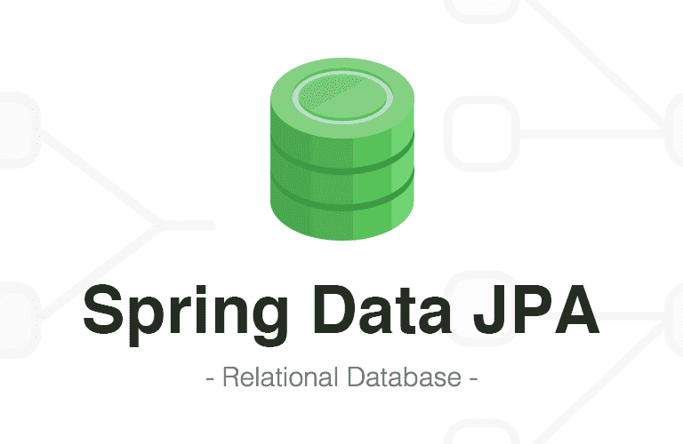
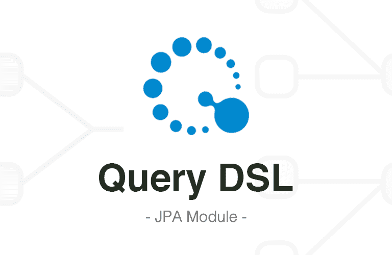

# Querydsl 맛보기

  
지금까지 프로젝트를 진행하거나 혼자서 기능들을 만들어볼때 주로 DAO 즉 레포지토리에서는 `Data JPA` 혹은 `JPQL`을 사용했다.  
단순한 쿼리기 필요할때에는 `Data JPA`를 사용했고  
연관된 엔티티가 많아 복잡한 쿼리를 야기하는 기능에서는 `JPQL`을 이용하곤했다.  
쿼리가 익숙하고 `Data JPA`를 사용했을 시 쿼리가 내가 원하는대로 최적화되어 생성되지않는 것 같아서  
주로 `JPQL`을 사용했는데 `이 방식에는 치명적인 단점이 존재했다.  
이는 바로 JPQL은 쿼리를 String으로 쓰는 방식이기때문에 코드 작성단계에서 검증이 어렵다는 문제이다.  
자신이 쿼리문의 달인이라면 상관없겠지만, 사소한 공백에도 예민한 쿼리를 디버깅도구의 도움없이 검증하기란 아주 까다로운일일 것이다.  
(기존 Jpql 방식은 그러니까 쿼리를 String으로 쓰는 방식은 쿼리를 잘못쓰면 프로젝트를 빌드할때까지 오류를 모르거나,
심지어 api 호출 할때까지 오류 못잡는 경우가 비일비재..)  
특히 "동적 쿼리"를 작성하게 되는 경우  
쿼리의 복잡도는 상상 이상으로 복잡해지기 때문에 쿼리문 작성에 더 좋은 방법이 필요했다. 
  
그러던 와중... 
### 김영한님의 JPA 강의에서 Querydsl을 접하게되었다!  

Querydsl을 이야기하기에 앞서 Querydsl의 강력함은 "동적 쿼리"작성시에 나타나기때문에   
먼저 "동적 쿼리"란 무엇인지 간단하게 집고 넘어가 보겠다.  

### 동적쿼리
동적쿼리란 검색 조건이나 정렬 기준 등이 사용자 입력에 따라 달라지는 경우에 유용한 방식이다.  
예를 들어서 사용자가 검색어를 입력하거나 선택한 필터에 따라 쿼리의 조건이 동적으로 변경 가능한 쿼리이다.  

아래 JPQL로 먼저 동적 쿼리를 작성해 보겠다!
```

public List<Order> findAll(OrderSearch orderSearch) {
    // JPQL 동적 쿼리를 생성하기 위한 기본 쿼리 문자열
    String jpql = "SELECT o FROM Order o JOIN o.member m WHERE 1=1";

    // 검색 조건에 따라 쿼리 문자열을 동적으로 추가합니다.
    if (orderSearch.getOrderStatus() != null) {
        jpql += " AND o.status = :status";
    }

    if (StringUtils.hasText(orderSearch.getMemberName())) {
        jpql += " AND m.name LIKE :name";
    }

    // EntityManager를 사용하여 JPQL 쿼리를 생성합니다.
    TypedQuery<Order> query = em.createQuery(jpql, Order.class);

    // 파라미터가 있는 경우, 쿼리에 파라미터를 설정합니다.
    if (orderSearch.getOrderStatus() != null) {
        query.setParameter("status", orderSearch.getOrderStatus());
    }

    if (StringUtils.hasText(orderSearch.getMemberName())) {
        query.setParameter("name", "%" + orderSearch.getMemberName() + "%");
    }

    // 결과를 리스트로 반환합니다.
    return query.getResultList();
}

```

위 코드를 살펴보자면  
클라이언트측에서 검색필터링을 이용해 검색하는 상황으로  
회원이름 필터링을 이용해검색하면 `if (StringUtils.hasText(orderSearch.getMemberName()))` 가 작동해서  
쿼리조건이 생기고  
상태 필터링을 이용하면 `if (orderSearch.getOrderStatus() != null)`이 작동하는 것이다.  
쉽게말해서, 클라이언트가 이름을 검색하려고 하면, name 필터 조건이 쿼리에 추가되고, 파라미터로 설정되고,  
클라이언트가 상태를 검색하려고 하면, status 필터 조건이 쿼리에 추가되고, 파라미터로 설정되는 것이다.  
그리고 두 조건이 모두 제공되면, AND 연산자로 두 조건이 결합되어 쿼리에 추가되는 것이다.  
`WHERE 1=1` 라는 조금 특이한 조건이 무엇이냐면  
WHERE문 뒤에 AND를 통해 동적으로 쿼리를 추가하기위해 항상 참인 조건을 넣어둔 것이다.  
(`WHERE 7=7`이어도 무방)  
  
  
위의 예시에서 볼 수 있듯 동적 쿼리를 JPQL로 작성하게되면 여러 쿼리가 상황에따라 바뀌게 설정되어  
디버깅이 쉽지않고 무엇보다 작성하기 쉽지않은 것을 볼 수 있다.  
이러한 문제를 해결해줄 강력한 무기가 바로 `Querydsl`인 것이다!!  
  

  
  

## Querydsl
QueryDSL은 정적 타입을 이용해서 SQL과 같은 쿼리를 생성할 수 있도록 해 주는 오픈소스 프레임워크이다.  
Querydsl은 Java로 작성된 쿼리 언어로, SQL을 사용하는 대신 Java 코드로 쿼리를 작성할 수 있게 해주고,  
인텔리제이같은 IDE의 지원을 받아, 컴파일 시점에 오류를 찾을 수 있으며, 타입 안전성을 보장하여 안정적인 쿼리 작성을 돕는다.


JPQL로 작성된 레포지토리 메서드는 심각한 매핑 오류 등이 아닌 타입오류는 빌드 시점에 잡아내지 못한다.  
때문에 QueryDSL이 컴파일 시점에 오류를 찾을 수 있다는 점은 아주 강력한 무기이다.  

또한 자바코드로 작성되어 쿼리를 직관적으로 확인하기 쉽게한다는 장점도 있다.  
아래는 위의 동적쿼리를 `QueryDSL`을 통해 작성한 코드이다. 


```
public List<Order> findAll(OrderSearch orderSearch) {
    // BooleanBuilder 객체를 생성하여 동적 쿼리를 구성합니다.
    BooleanBuilder builder = new BooleanBuilder();

    // 주문 상태가 존재하는 경우, 해당 주문 상태를 검색 조건에 추가합니다.
    if (orderSearch.getOrderStatus() != null) {
        builder.and(order.status.eq(orderSearch.getOrderStatus()));
    }

    // 회원 이름이 존재하는 경우, 해당 회원 이름을 검색 조건에 추가합니다.
    if (StringUtils.hasText(orderSearch.getMemberName())) {
        builder.and(member.name.like("%" + orderSearch.getMemberName() + "%"));
    }

    // Querydsl을 사용하여 쿼리를 작성하고 실행합니다.
    return queryFactory.selectFrom(order)
            .leftJoin(order.member, member)
            .where(builder) // 위에서 구성한 동적 조건을 쿼리에 적용합니다.
            .fetch(); // 결과를 리스트로 반환합니다.
}
```
자바 코드로 작성하니 실행전부터 확실히 직관적이어진 모습을 볼 수 있다.  
또한 자바로 쿼리를 작성했으니 메소드 실행시점이 아닌 컴파일시점에 오류를 잡아낼 수 있다.  
아래는 간단한 코드 설명이다.
### 설명
1. BooleanBuilder 생성  
`BooleanBuilder`는 Querydsl에서 동적 쿼리를 생성할 때 사용하는 빌더 클래스, 
`builder` 객체를 생성하여 동적 쿼리를 조립.

2. 검색 조건 추가  
`orderSearch` 객체에 따라 주문 상태와 회원 이름의 검색 조건을 동적으로 추가,
   `orderSearch.getOrderStatus()`와 `orderSearch.getMemberName()`을 사용하여 각 조건이 존재하는지 확인하고, 조건이 존재하는 경우에만 해당 조건을 `BooleanBuilder`에 추가.

3. Querydsl을 사용한 쿼리 작성  
   `queryFactory.selectFrom(order)`를 사용하여 `Order` 엔티티를 대상으로 하는 쿼리를 생성.
   `leftJoin(order.member, member)`를 사용하여 회원과의 조인을 수행하고, `where(builder)`를 통해 위에서 구성한 동적 조건을 쿼리에 적용.
   `builder.and`는 쿼리 조건 추가
   `order.status.eq(orderSearch.getOrderStatus())`는 파라매터로 받은 OrderSearch 객체의 속성중 status를 통해 필터링 수행
3. 쿼리 실행  
`fetch()` 메서드를 호출하여 쿼리를 실행하고, 결과를 리스트로 반환.


아래부터는 Querydsl을 사용하기위한 설정들이다.  
QueryDSL은 JPA 표준이 아니기 때문에 별도로 라이브러리를 추가해주어야 한다.
설정이 조금 복잡하니까 기록하는 용도로 작성해 보았다.   

### build.gradle 설정

```gradle
buildscript {
	ext {
		queryDslVersion = "4.4.0"
	}
}

plugins {
	id 'org.springframework.boot' version '2.4.1'
	id 'io.spring.dependency-management' version '1.0.10.RELEASE'
	id 'java'
}

dependencies {
	implementation "com.querydsl:querydsl-jpa:${queryDslVersion}"
	annotationProcessor(
			"javax.persistence:javax.persistence-api",
			"javax.annotation:javax.annotation-api",
			"com.querydsl:querydsl-apt:${queryDslVersion}:jpa")
	implementation 'com.querydsl:querydsl-jpa'
	annotationProcessor 'com.querydsl:querydsl-apt:4.4.0'
	implementation 'com.querydsl:querydsl-apt'
}
```

이런 흐름으로 설정

주의점 : `buildscript` 이게 `plugins`이거 앞에 와야함

## 빈등록
```java
package jpabook.jpashop;
    
import com.querydsl.jpa.impl.JPAQueryFactory;
import org.springframework.context.annotation.Bean;
import org.springframework.context.annotation.Configuration;

import javax.persistence.EntityManager;
import javax.persistence.PersistenceContext;

@Configuration
public class QueryDslConfig {

    @PersistenceContext
    private EntityManager entityManager;

    @Bean
    public JPAQueryFactory jpaQueryFactory() {
        return new JPAQueryFactory(entityManager);
    }
}


```

## 정리
QueryDSL을 사용하면 Java 언어로 쿼리를 작성할 수 있으므로  
SQL을 사용하는 것보다 훨씬 직관적이고 안전하며 유연하게 데이터베이스와 상호작용할 수 있다. 
그러나 모든 레포지토리의 쿼리를 QueryDSL로 작성하거나,   
기존의 Data JPA 혹은 JPQL을 QueryDSL로 마이그레이션할 필요는 없다.  
모든 기술의 사용에는 이유가 있어야 한다.

Data JPA는 메서드 이름으로 쿼리를 생성할 수 있다는 장점이 있으며, 
CrudRepository, JpaRepository와 같은 인터페이스를 상속받아 기본적인 CRUD 작업을 자동으로 구현해준다는 장점이 있다.  
JPQL은 명시적으로 쿼리를 작성할 수 있어 복잡한 쿼리를 보다 명확하게 정의할 수 있다는 장점이 있다.

## 나름의 사용 상황 정리 
- 간단한 CRUD 작업 : Spring Data JPA
- 복잡한 쿼리: JPQL
- 동적 쿼리: QueryDSL


